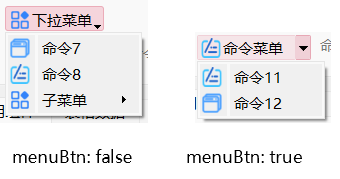
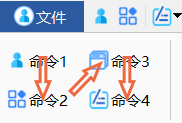
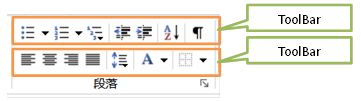
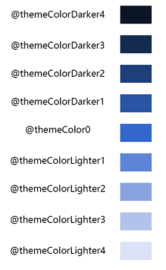
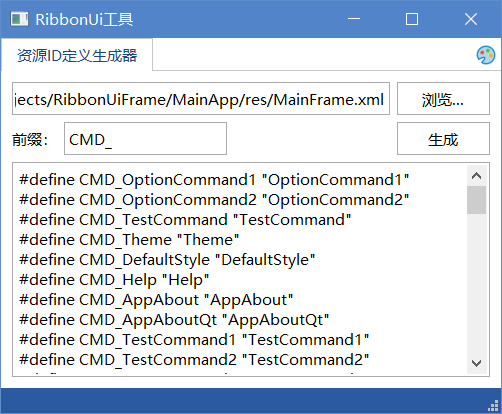

# 基于Qt的模块化界面框架

这是一个界面框架模块，实现了Ribbon风格的样式，使用xml文件配置Ribbon标签页。框架完全使用原生Qt库，无第三方依赖，支持Windows和Linux系统。

此框架可以将Qt或MFC/Win32程序集成到同一个应用程序中。你可以使用Qt或MFC/Win32编写功能模块，并加载到主框架中，并在主框架中以Ribbon标签的方式显示。

工程中包含了一个框架测试程序、一个基于Qt的测试模块、一个基于MFC对话框的测试模块和一个基于Qt的主题模块。

界面框架支持更换主题，内置了十几种风格的主题。主题基于QSS实现，其中部分主题来自开源项目[QSS-Skin-Builder](https://github.com/satchelwu/QSS-Skin-Builder)。

框架使用了xml文件配置Ribbon界面中的所有元素。框架具有以下特点：

* 轻量化，无第三方依赖。使用Qt编写，只依赖Qt原生库。

* 跨平台。支持支持Windows和Linux系统，在所有系统中均能获得一致的界面和功能。

* 支持多种主题自由切换。支持系统原生主题、Office2010/Office2013/Office2016风格主题，以及其他十几种深色和浅色主题。

* 提供完整的Ribbon界面。支持Ribbon界面的开始按钮、快速启动栏、标签、功能区等。

* 方便的界面配置。界面全部通过xml配置，通过xml文件配置界面具有方便直观的优点。同时，将界面放到xml文件中，与C++代码分离，提高了程序的可维护性。

* 模块化。支持将不同的软件作为模块加载，实现了模块化的软件设计。只需要在功能模块中实现指定的接口，并在xml文件中配置好模块的动态库，即可将模块加载到界面框架中。关于模块化的实现请参照二次开发说明章节。

界面截图▼


# 环境说明

* 开发环境： Windows 10 / Windows11
* 开发工具  Qt Creator 10.0.2 / Visual Studio 2022
* Qt 版本  5.15.2
* 编译器版本  Microsoft Visual C++ 2022
* 软件运行环境  Windows 10 / Windows 11

# 目录说明

| 目录        | 说明                                                         |
| ----------- | ------------------------------------------------------------ |
| RibbonFrame | 界面框架核心动态库，包含一个RibbonFrameWindow类作为程序的主窗口。 |
| MainApp     | 界面框架的示例程序，依赖RibbonFrame。                        |
| OfficeStyleApp | 一个不使用模块的Office风格的示例程序。                       |
| TestModule  | Qt测试模块，RibbonFrame模块加载时会根据xml中配置的文件名加载该模块。 |
| MFCModule   | MFC测试模块，RibbonFrame模块加载时会根据xml中配置的文件名加载该模块。 |
| StylePlugin | 主题模块，如果需要支持更换主题功能需要加载此模块。           |
| bin         | 输出的二进制文件。                                           |
| include     | 公共的头文件。                                               |

# 二次开发说明

## 二次开发步骤

要在你的项目中使用此界面框架，请遵循以下步骤：

* 将RibbonFrame的依赖添加到你的主工程中。

  ```
LIBS +=-lRibbonFrame
  ```

* 并修改main.cpp中的代码：

  * 添加`include/ribbonframewindow.h`头文件包含，使用`RibbonFrameWindow`类作为程序的主窗口。

  * 你也可以自定义`RibbonFrameWindow`类的派生类作为程序主窗口，在派生类中重写`OnCommand`用于响应需要在主窗口中响应的命令。

* 编辑`MainApp/res/Mainframe.xml`文件定义框架中的命令、菜单、控件等。

* 关于此文件的编写规则请参照本文档中的“界面xml文件说明”章节。xml文件可以放在资源文件中，也可以独立于应用程序。xml文件的路径通过`RibbonFrameWindow`的构造函数传递，如果该路径为空，则默认读取应用程序所在目录下名为`Mainframe.xml`的文件。

* 添加你自己的功能模块。

  * 在你的工程中添加一个动态库项目作为一个功能模块，并在xml文件中的`Page`节点中配置模块的名称。

  * 模块类必须实现`IModule`接口，并实现以下必要的虚函数：

    | 虚函数            | 说明                                                         |
    | ----------------- | ------------------------------------------------------------ |
    | InitInstance      | 模块被加载后由框架调用，在这里添加一些初始化的代码。         |
    | UnInitInstance    | 模块被析构前由框架调用，在这里添加一些清理、保存的代码。     |
    | UiInitComplete    | 界面加载完成后由框架调用，并传递`IMainFrame`接口的指针，可以通过此指针调用框架接口。对框架命令、控件的初始化工作必须在此函数中进行。 |
    | GetMainWindowType | 返回主窗口的类型，如果模块是一个Qt工程，则返回`IModule::MT_QWIDGET`，如果是一个MFC工程，则返回`IModule::MT_HWND`。 |
    | GetMainWindow     | 根据GetMainWindowType的返回值返回一个QWidget对象的指针或HWND句柄。为框架提供一个主窗口作为此模块的主窗口。 |
    | GetModuleName     | 返回此模块的名称。此名称为框架区分不同模块的唯一标识，不同模块的名称不能相同。 |
    | OnCommand         | 当主窗口触发了一个命令时由框架调用。响应框架中命令的触发事件必须在此函数中。 |
    
  * 模块导出一个名为`CreateInstance()`的函数，在函数中创建模块类的对象，并返回其指针。此对象在模块中创建，并由框架负责释放。
  
  如果需要添加的模块不需要界面，并且不需要关联Ribbon页面，请在xml文件的`Plugins`节点下配置要添加的插件。例如本工程中的`StylePlugin`模块。

## 集成基于MFC的模块

你还可以将一个基于对话框的MFC工程集成到框架中，并在框架中显示MFC的主窗口。

要集成MFC模块，请参照`MFCModule`里的示例代码。

在集成基于MFC的模块时，有以下几点需要注意：

* 由于MFC窗口在初始化后且还未嵌入框架内时，会短暂地显示一段时间，导致程序时窗口会短暂地闪现一次，因此必须使得MFC窗口在初始化时保持隐藏状态，直到`IModule::UiInitComplete`函数被调用时再显示。具体做法是，响应对话框的`WM_WINDOWPOSCHANGING`消息，并在消息处理函数中添加如下代码：

  ```c++
  if (!m_windowVisible)
      lpwndpos->flags &= ~SWP_SHOWWINDOW;
  ```

  其中`m_windowVisible`为对话框的成员变量，初始时为fase，在`IModule::UiInitComplete`函数被调用时将其置为true。

* 在MFC模块中实现`IModule`的`InitInstance()`和`UnInitInstance()`接口时，请参`MFCModule`里的示例代码。

* 编译MFC项目时，在Visual Studio的“项目”>“属性”>“高级”中，“MFC 的使用”一项应该设置为“在共享 DLL 中使用 MFC”，不能设置为“在静态库中使用 MFC”。

## 获取和设置功能区命令和控件的状态

* 在模块中重写IModule接口中的虚函数UiInitComplete，保存此函数传递的IMainFrame接口的指针。

* 通过IMainFrame接口可以获取和设置控件的状态。

下表列举了IMainFrame接口一些常用的函数。

| 虚函数                           | 说明                                                         |
| -------------------------------- | ------------------------------------------------------------ |
| GetAction                        | 根据id获取功能区一个QAction对象。                            |
| GetWidget                        | 根据id获取功能区一个控件。                                   |
| GetMenu                          | 根据id获取功能区一个菜单。                                   |
| SetItemEnable/IsItemEnable       | 根据id设置/获取功能区一个控件的启用/禁用状态。               |
| SetItemChecked/IsItemChecked     | 根据id设置/获取功能区一个Action、CheckBox或RadioButton的选中状态。 |
| SetItemText/GetItemText          | 根据id设置/获取功能区一个Action或控件的文本。                |
| SetItemCurIIndex/GetItemCurIndex | 根据id设置/获取Combox或ListWidget当前选中项。                |

## 响应控件事件

在模块中重写IModule接口中的虚函数OnCommand，可以响应Action、CheckBox或RadioButton的点击事件。

在模块中重写IModule接口中的虚函数OnItemChanged，可以响应一些控件事件，例如Combox或ListWidget当前选中项的改变，或LineEdit/TextEdit文本的改变。

## 模块间通信

模块中重写`IModule`接口中的虚函数`UiInitComplete`，此函数会传递`IMainFrame`接口的指针，保存此指针。

### 向模块发送消息

* 调用`IMainFrame::SendModuleMessage`向模块发送一个消息。
### 接收模块消息

* 在模块实现类中重写`IModule`接口的`OnMessage`函数，使用`SendModuleMessage`函数向此模块发送了消息时，此函数会被调用。

重写`RibbonFrameWindow`中的`SendModuleMessage`函数也可以在主窗口中响应模块消息。注意，在`RibbonFrameWindow`的派生类中重写`SendModuleMessage`函数时，必须调用基类`RibbonFrameWindow`中的`SendModuleMessage`，以确保模块消息可以被发送到对应模块。

## 不使用模块

此框架也允许不使用任何模块，直接在exe工程中编写你的逻辑代码。

如果在使用此框架时不需要使用模块，请遵循以下步骤。

* 编写界面xml文件，但是`Page`节点不配置`modulePath`属性。
* 编写一个类继承于`RibbonFrameWindow`类作为程序的主窗口。
* 在主窗口类的构造函数中调用基类的`SetDefaultWidget`设置一个默认的窗口，此窗口会代替模块主窗口显示在界面中。
* 重写基类的`OnCommand`函数可以响应Ribbon标签中命令的触发，重写基类的`OnItemChanged`可以响应Ribbon标签中的控件消息。

# 界面xml文件说明

界面框架使用xml文件配置界面，xml文件的路径通过`RibbonFrameWindow`的构造函数传递，如果该路径为空，则默认读取应用程序所在目录下名为`Mainframe.xml`的文件。

xml文件节点可分为功能节点、容器节点和控件节点。

## 容器节点

### root节点

xml文件唯一的根节点。

**属性说明**

* appName：程序的名称。
* font：字体名称。
* fontSize：字体的大小。

### MainWindow节点

MainWindow节点下包含所有主窗口元素，例如Page、SystemMenu、QuickAccessBar、Action。这些节点可以放在MainWindow节点下，也可以直接放在root节点（根节点）下。

MainWindow节点必须放在根节点下。

MainWindow节点或根节点下的控件节点将被添加到窗口的右上角。

**属性说明**

- title：窗口标题

  如果有此属性，则用此属性的值作为窗口标题，否则使用root节点下appName属性的值作为窗口标题。

MainWindow节点不是必须的，所有放在MainWindow下的子节点都可以直接放在root节点（根节点）下面。

### Page节点

Page节点为主界面中的一个标签页，对应一个模块。

在主界面中切换到一个标签页时，会显示对应模块的主窗口。

**属性说明**

* name：模块名，用于显示在标签页上。
* icon：显示在标签页上的图标。
* modulePath：需要加载的模块的路径。（必须使用相对路径，不需要扩展名，框架会自动根据当前系统系统类型加载正确的动态库。如果动态库就放在可执行目录相同目录下，只需将modulePath属性配置为动态库的文件名即可。）

你也可以在多个Page节点中指定相同的modulePath属性，此时多个标签将对应同一个模块，切换到这些标签时，显示的都该模块的主窗口。

modulePath属性不是必须的，如果不指定modulePath属性，则该页面不关联模块。

### ActionGroup节点

将若干个Action和其他控件添加到一个组中。

一个ActionGroup由若干个Action、组名称和选项按钮组成，如下图所示：


其中组名称由ActionGroup的name属性指定。选项按钮由optionBtn属性指定，当点击选项按钮时，OnCommand会响应，传递的命令ID由ActionGrou的id属性指定。

**属性说明**

* name：组的名称。
* optionBtn：是否在命令组的右下角显示选项按钮。
* id：当optionBtn属性为true时点击选项按钮，OnCommand函数会传递此ID。

Page节点下的Action节点可以放到ActionGroup节点下，也可以直接放到Page节点下。

如果不指定name属性，则组名称和选项按钮都不会显示。

### QuickAccessBar节点

显示在界面左上角的快速启动栏，子节点可以是所有控件节点。

QuickAccessBar节点必须位于根节点或MainWindow节点下。

### SystemMenu节点

显示在界面左上角按钮，点击后会弹出系统菜单。

SystemMenu节点必须位于根节点或MainWindow节点下。

**属性说明**

name：显示在左上角按钮上的文本。

icon：显示在左上角按钮上的图标。

### WidgetGroup节点

将若干个Widget组合到一起。子节点可以是除了Action、Separator、Menu以外的所有控件节点，也可以是ToolBar节点。

**属性说明**

* horizontalArrange：如果为true，则WidgetGroup中的项目为水平排列。未设置时为true。

### ToolBar节点

一个工具栏，子节点可以是所有控件节点。子控件水平排列。图标大小固定为16x16。

### StatusBar节点

状态栏。子节点可以是所有控件节点。控件将被添加到状态栏的左侧。如果将控件放在PermanentWidget节点下面，则将显示在状态栏的右侧。

StatusBar节点必须位于根节点或MainWindow节点下。

### PermanentWidget节点

仅作为StatusBar节点的子节点，子节点可以是所有控件节点。控件将被添加到状态栏的右侧。

## 控件节点

### Action节点

Action节点用于设置模块标签页下工具栏中的命令、菜单下的命令，以及标签栏右上角的命令。

**属性说明**

* name：用于显示在工具栏中命令的名称。
* icon：用于显示在工具栏中命令的图标的路径。
* id / commandID：命令的ID，用于在程序中响应命令、设置命令状态时需要用到的ID。注意：即使在不同模块中，每个命令的ID也必须是唯一的。
* checkable：设置此命令是否可以被选中。
* checked：设置此命令是否默认选中。
* enable / enabled：设置此命令是否处于启用状态
* tip：设置鼠标指向此命令时的鼠标提示。
* radioGroup：命令组号，用于设置此命令是否要和其他命令组成一组单选按钮，也就是说，处于同一个命令组的命令，一次只会有一个命令被选中。注意：即使在不同模块中，不同命令组的ID也不能相同。
* shortcut：执行此命令的快捷键
* smallIcon：是否为小图标，如果为true，则若干个连续的小图标会在工具栏中垂直排列以节省空间。
* btnStyle：命令的风格，可以为以下值之一：

  * compact：紧凑按钮，文本显示在图标旁边，效果同smallIcon为true。
  * textOnly：仅文本，即使指定了icon属性也不显示图标。
  * iconOnly：仅图标，不显示文本。

### Separator节点

显示在工具栏中的分隔符。

### Menu节点

在工具栏中显示一个有下拉菜单的按钮

**属性说明**

* name：菜单按钮的名称

* icon：菜单按钮的图标

* menuBtn：如果为true，此按钮显示为按钮和箭头两部分，点击按钮部分响应命令，点击箭头部分显示下拉菜单。如果为false，则此按钮只有一个部分，点击后直接显示下拉菜单。

  

* id：命令id，当menuBtn为true时有效

* smallIcon：同Action节点

* btnStyle：同Action节点

Menu节点下面可以包含Action节点、Separator节点ToolBar节点和其他控件节点，也可以嵌套Menu节点。

**属性说明**

* name：按钮上的文本
* icon：按钮上的图标

SystemMenu节点下面可以包含Action节点、Separator节点和其他控件节点，也可以嵌套Menu节点。

### Label节点

添加一个QLabel对象。

**属性说明**

* icon：显示在QLabel左侧的图标。

**注意：**如果为Labe指定了图标，则使用`IMainFrame::GetWidget`函数获取到的对象将不再是QLabel，也就是说，使用以下代码将无法获取到QLabel的指针：

```
QLabel* pLabel = qobject_cast<QLabel*>(GetWidget(strId))
```

在这种情况下，可以使用`IMainFrame::SetItemText`和`IMainFrame::GetItemText`函数设置和获取Lable上的文本，还可以使用`IMainFrame::SetItemIcon`函数设置Label左侧的图标。

### LineEdit节点

添加一个QLineEdit对象。

**属性说明**

* editable：是否可以编辑。未指定时为true

### TextEdit/Edit节点

添加一个QTextEdit对象。

**属性说明**

* editable：是否可以编辑。未指定时为true

### ComboBox节点

添加一个QComboBox对象。

**属性说明**

* editable：是否可以编辑。未指定时为false

### CheckBox节点

添加一个QCheckBox对象。

### RadioButton节点

添加一个QRadioButton对象。

**属性说明**

* radioGroup：设置QRadioButton所在组，具有相同radioGroup值的RadioButton为同一组。

### ListWidget节点

添加一个QListWidget对象。

**属性说明**

* horizontalArrange：如果为true，则ListWidget中的项目为水平排列。

### UserWidget节点

添加一个用户自定义控件。

如果你需要添加其他控件到功能区，可以使用UserWidget节点。

当框架需要创建此控件时，会调用对应`IModule`接口中的`CreateRibbonWidget`函数，模块需要在此函数中根据id创建自定义控件，并返回控件的指针。

### 通用属性

所有控件节点都具有以下通用属性：

id：控件的id

name：控件的名称

width：控件的宽度度

height：控件的高度

enable / enabled：控件是否处于启用状态

## 功能节点

### Plugins节点

Plugins节点用于配置需要加载的无界面模块。类似于Page节点，但是在这里配置的模块将不会显示主窗口。

Plugins节点必须位于根节点下。

### Plugin节点

仅作为Plugins节点的子节点，每个模块在子节点Plugin中配置，path属性为插件的路径，同Page节点的modulePath属性。

## 界面搭建的一些技巧

* Action节点可以放在ActionGroup里面，也可以直接放在Page节点下。

* Action节点默认为大图标，若干个Action将水平排列，如果想要让Action显示为小图标，则可以设置smallIcon属性为true，此时Action将以两个一组显示，排列顺序如下图所示：

   

* ToolBar节点可以在功能区添加一个子工具栏，如果你要实现两个子工具栏并排显示时可以使用ToolBar节点。如下图所示：

   

   在ActionGroup节点下添加两个ToolBar节点，在ToolBar节点中添加Action节点。要使两个ToolBar并排显示，必须为两个ToolBar节点指定smallIcon属性为true。

* 若干个Action选中状态互斥。

   如果要使多个Action的选项状态互斥，即同时只有一个Action选中，可以使用RadioGroup属性，为同一组Action设置相同的RadioGroup值即可。RadioGroup属性可以对Action和RadioButton生效。示例xml代码如下：

```xml
<Action name="放大" icon="./Image/scaleUp.png" id="MapZoomIn" radioGroup="1"/>
<Action name="缩小" icon="./Image/scaleDown.png" id="MapZoomOut" radioGroup="1"/>
<Action name="平移" icon="./Image/roamTool.png" id="MapPan" radioGroup="1"/>
<Action name="选择" icon="./Image/selectTool.png" id="MapSelect" radioGroup="1"/>
```

上面代码中的4个Action设置了相同的radioGroup值，则这4个Action的选中状态将会是互斥的。

# 主题模块

框架支持更换主题，更换主题由主题模块提供。如果需要让框架支持更换主题，需要加载`StylePlugin`模块。

在`MainFrame.xml`中通过`Plugins`加载主题插件：

```xml
<Plugins>
	<Plugin path="StylePlugin"/>
</Plugins>
```

然后在`MainFrame.xml`中添加如下代码：

```xml
<Menu name="主题" icon="./Image/color.png" id="Theme" btnStyle="compact">
	<Action name="默认主题" id="DefaultStyle" checkable="true"/>
</Menu>
```

其中“主题”菜单的id必须为`Theme`，菜单下包含一个id为`DefaultStyle`的Action。

`StylePlugin`模块会自动查找id为`Theme`的菜单，并在菜单下添加其他支持的主题。如果主题加载成功，“主题”菜单将如下图所示：


## 主题颜色

框架的主题通过qss样式表实现，要使样式表支持主题颜色，在样式中指定颜色时请使用下表中的颜色占位符，而不是显式指定颜色值。

| 颜色占位符          | 说明                  |
| ------------------- | --------------------- |
| @themeColorOri      | 原始主题色            |
| @themeColor0        | 亮度值为 128 的主题色 |
| @themeColorLighter1 | 亮度值为 154 的主题色 |
| @themeColorLighter2 | 亮度值为 180 的主题色 |
| @themeColorLighter3 | 亮度值为 206 的主题色 |
| @themeColorLighter4 | 亮度值为 232 的主题色 |
| @themeColorDarker1  | 亮度值为 102 的主题色 |
| @themeColorDarker2  | 亮度值为 76 的主题色  |
| @themeColorDarker3  | 亮度值为 50 的主题色  |
| @themeColorDarker4  | 亮度值为 24 的主题色  |

颜色占位符代表了当前主题色的不同亮度值，不同占位符代表的颜色亮度值参见下图：



注意，目前仅Office2013和Office2016主题支持主题颜色。

## 主题模块消息

主题插件支持了一些模块消息，用于和其他模块或主窗口通信。消息类型在`include/ribbonuipredefine.h`中定义。

### 由主题模块发出的消息

以下消息由主题模块发送给其他所有模块。

| 消息类型（msgType）     | 说明                 | 参数（msgData）       | 返回值 |
| ----------------------- | -------------------- | --------------------- | ------ |
| MODULE_MSG_StyleChanged | 通知主题样式已改变。 | 样式名称，QString类型 | 无     |

### 由主题模块接收的消息

| 消息类型（msgType）      | 说明                       | 参数（msgData）                                              | 返回值                         |
| ------------------------ | -------------------------- | ------------------------------------------------------------ | ------------------------------ |
| MODULE_MSG_GetStyleType  | 获取当前主题样式类别。     | 无                                                           | CStyleManager::StyleType类型。 |
| MODULE_MSG_GetStyleName  | 获取当前主题样式名称。     | 无                                                           | 主题名称，QString类型。        |
| MODULE_MSG_IsDarkTheme   | 获取当前主题是否为深色主题 | 无                                                           | bool类型。                     |
| MODULE_MSG_SetThemeColor | 设置当前主题颜色           | 主题颜色，QString类型。主题颜色的十六进制值，如#557eef，可以通过QColor::name函数得到 | 无                             |

## 配置数据

主题模块支持在程序退出后记住上次选择的主题和主题颜色，配置数据保存在注册表的以下位置中：

```
\HKEY_CURRENT_USER\SOFTWARE\Apps By ZhongYang\<应用程序名称>\
```

其中的`<应用程序名称>`由`qApp->applicationName()`得到。

该位置保存了以下数据：

| 名称       | 类型   | 说明                                                         |
| ---------- | ------ | ------------------------------------------------------------ |
| style      | 字符串 | 上次选择的主题名称。如果为空则为默认主题。                   |
| themeColor | 字符串 | 上次选择的主题颜色。颜色的十六进制值，由`QColor::name`得到。 |

# RibbonUi工具

包含一些小工具。

## 资源ID定义生成器

一个用于从xml文件自动生成资源ID宏定义的小工具。



点击“浏览”按钮选择资源xml文件，点击“生成”按钮，在下方文本框内会生成xml文件内所有id的宏定义，可以将这些宏定义复制到你的代码中使用。

